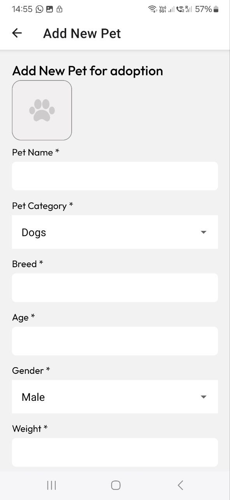
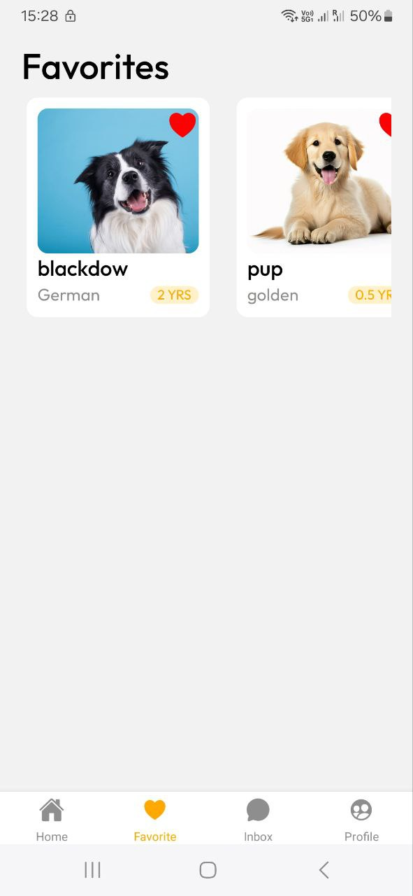
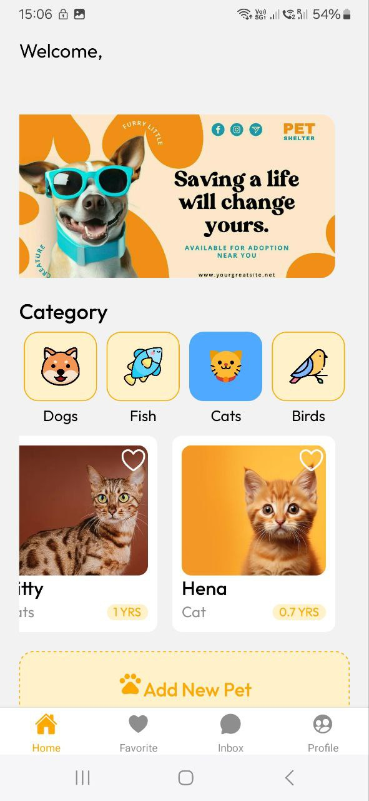

# PawPal


**PawPal** is a React Native Expo mobile application that facilitates pet adoption. The app provides a platform for users to browse, mark favorites, and communicate about pets for adoption. It features a Firebase-integrated backend for storing pet and user data, while user authentication, login, and CAPTCHA verification are handled by Clerk.

## Table of Contents

- [Project Overview](#project-overview)
- [Key Features](#key-features)
- [Technologies Used](#technologies-used)
- [Setup and Installation](#setup-and-installation)
- [App Navigation](#app-navigation)
- [Firebase Configuration](#firebase-configuration)
- [Clerk Integration](#clerk-integration)
- [Project Structure](#project-structure)
- [Contributing](#contributing)
- [License](#license)

---

## Project Overview

PawPal aims to simplify the process of pet adoption, offering users the ability to view detailed pet profiles, mark pets as favorites, and chat with other users or owners about adopting pets. The app is built using React Native Expo SDK 52 and integrates Firebase for data storage and Clerk for managing user authentication and CAPTCHA verification.

## Key Features

- **Home Page**: Browse a list of available pets for adoption with detailed profiles.
- **Favorites**: Mark pets as favorites for easy access later.
- **Profile Page**: View and edit user profile details.
- **Chat/Inbox**: Communicate with other users regarding pet adoption.
- **Firebase Integration**: Manage pet and user data.
- **Clerk Authentication**: Secure user login and CAPTCHA verification.

## Technologies Used

- **React Native Expo SDK 52**
- **Firebase** for data management
- **Clerk** for user authentication and CAPTCHA verification

## Setup and Installation

### Prerequisites

- Node.js and npm installed
- Expo CLI installed
- Firebase project set up
- Clerk account created and configured

### Steps

1. **Clone the Repository**
   ```bash
   git clone https://github.com/your-repo/pawpal.git
   cd pawpal
   ```


